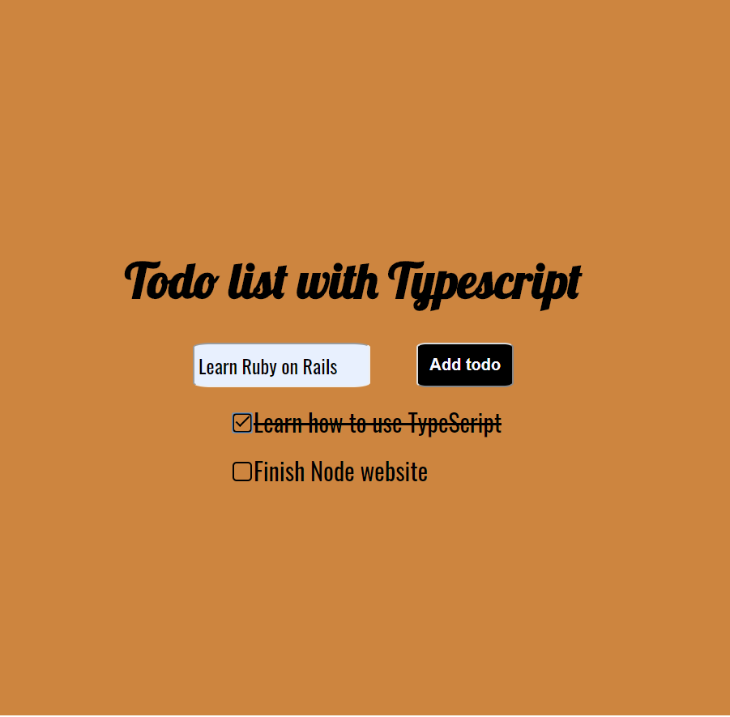

# What is this project?

A small to do list project made with the purpose of introducing myself to TypeScript.

# What did I learn in addition to TypeScript basics?

I decided to create custom checkboxes, but found that because of the reusable component rendering the li in the list, the ids were always the same and therefore only one item could be checked. I solved this by using the uuid package. In the future, I'd like to find a better way as uuid creates quite long and complicated ids, which isn't really the use case here.

Additionally, I chose to diverge from the tutorial I was following and make more use of the useState hook to achieve the same results in rendering a dynamic list :)
